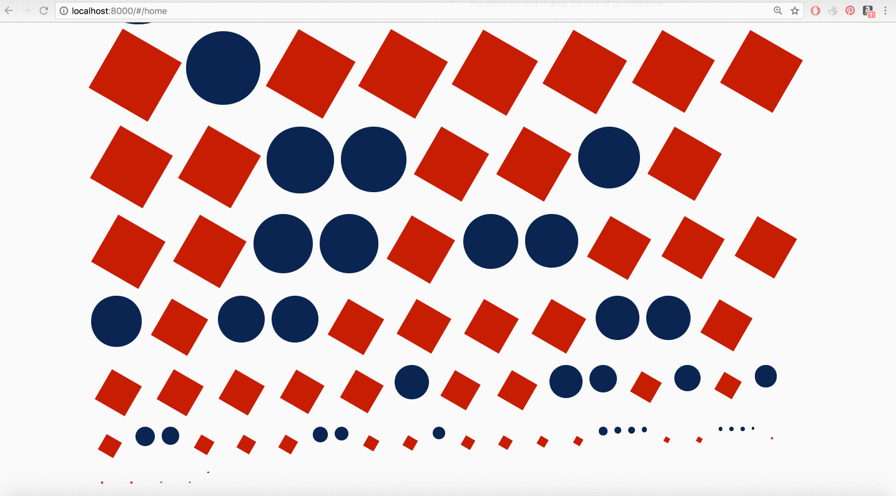

# RAZR FRONT-END DEVELOPER CODING TEST

## Application Overview
A web responsive app that regenerates and renders an array of shapes (circles and squares)
with random size and rotates the squares by 10 degrees every iteration.

_razrApp_

## Technologies
- Express
- AngularJS
- Node.js
- Angular Material
- Grunt
- Heroku

## Setup
1. Clone the repo to your computer using `git clone https://github.com/claudiacalderas/razr_frontend_exercise.git`
2. Run `npm install`
3. Run `grunt`
4. Start the server by running `npm start`

## Application Features/Requirements

**Section 1. JavaScript**

- The Circle Object
Create a Circle object with the following behavior:

Instances can be created with any desired radius 

Instances have a ‘getArea’ method that returns the area of the circle
Instances have a 'toString' method that returns the following:

`Circle: Radius = X, Area = Y`

(where X and Y are the radius and the area of the circle)

- The Square Object
Create a Square object with the following behavior:

Instances can be created with any length of sides 

Instances have a 'getArea' method that returns the area of the square
Instances have a 'toString' method that returns the following:

`Square: Size = X, Area = Y`

(where X and Y are the side length and area of the square)

- Sorting Function
Create a method that accepts an array of Circles and Squares, and returns the array sorted by area, in descending order.

- Generate Function
Create a method that generates an array of 50 squares of varying side length between 1 and 100, and 50 circles of varying diameter between 1 and 100. The sizes of each shape should be randomly generated.

**Section 2. HTML/CSS**

Using the functionality created above, and any additional scripting needed, create a web page that displays the sorted list of shapes.

- Requirements:
Squares should be drawn with a red background 

Circles should be drawn with a blue background 

Each time the page is loaded, a new set of shapes should be generated

**Bonus Section (Optional)**

Make the web page start a timer that regenerates and rerenders the shapes twice every second. Each half second, rotate the squares by 10 degrees. 
